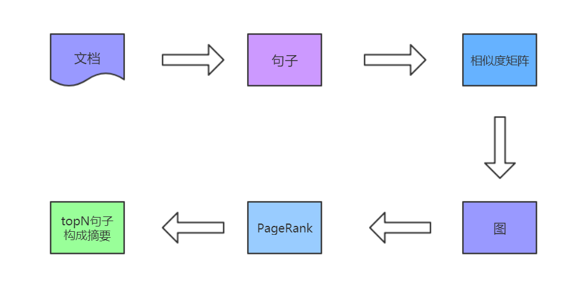

## Automatic Summarization

### Required Packages

- python 3.6
- numpy 1.15.4
- networkx 2.2
- nltk

---

### Model

---

### Result

文章标题：

Apple has released the first beta of iOS 12.3 and tvOS 12.3 to developers

输出标题（top3）：
 You can read more about installing beta software on iOS and Apple TV devices on Apple's support page. The new 12.3 betas include the new Apple TV app which is scheduled to officially launch in May. Apple has released the first beta of iOS 12.3 and tvOS 12.3 to developers

---

### Update

- 2019.4.1 添加了手动计算PageRank的方法。

---

### Others

后期会实现使用中文数据和使用深度学习框架。

供大家参考，欢迎给个 **star** 或 **fork**  。